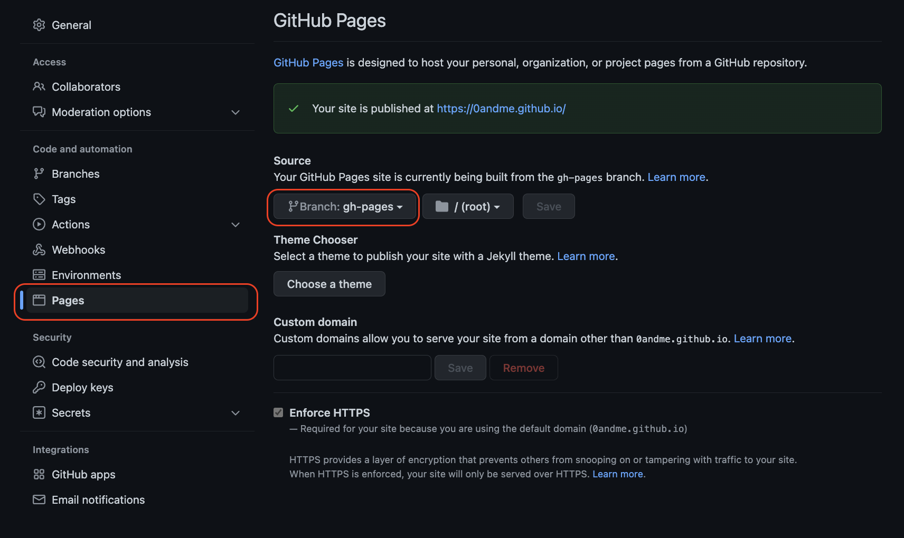

#### 🚩 TODO

- Gatsby 설치
- 템플릿 적용하고 로컬 서버 열어보기
- 서버 배포하기

#### 1️⃣ Gatsby CLI 설치

<a target='_blank' href="https://www.gatsbyjs.com/docs/tutorial/part-0/">Gatsby 공식 가이드 문서</a>에서는 필수 툴로 네가지를 요구하고 있다. 나는 Gatsby CLI만 추가로 설치했다.

- Node.js (14버전 이상)
- Git
- VScode
- Gatsby command line interface (Gatsby CLI)

✤ gatsby-cli 설치

```js
npm install -g gatsby-cli
gatsby --version
```

#### 2️⃣ Gatsby 템플릿으로 프로젝트 생성 및 로컬 서버 열기

`gatsby new` 명령어를 터미널에 입력하면 사이트명, 사용할 언어(JS vs TS), 사용할 스타일 라이브러리 등의 옵션을 미리 고를 수 있는데 일단 프로젝트를 만들고나서 추후에 변경하면 되고 템플릿을 적용할 것이기 때문에 `gatsby new [프로젝트명] [템플릿 주소]`를 입력하면 된다.<br><br>나는 가장 기본적인 `gatsby-starter-blog` 템플릿을 사용했다. <a href="https://www.gatsbyjs.com/starters/?v=2" target="_blank" rel="noopener noreferrer">➡️ 더 많은 템플릿 구경하기</a> <br> 나의 프로젝트명은 `blog`이다. 성공적으로 프로젝트를 만들고 나면 현재 폴더 아래 프로젝트 폴더가 생긴다. <br><br>

✤ 프로젝트 생성

```js
gatsby new [프로젝트명] [템플릿 주소]
gatsby new blog https://github.com/gatsbyjs/gatsby-starter-blog

//npx로 프로젝트를 생성할 수도 있다.

npx gatsby-cli new [프로젝트 명][템플릿 주소]
npx gatsby-cli new blog https://github.com/gatsbyjs/gatsby-starter-blog

```

프로젝트가 만들어졌다면 현재 폴더를 프로젝트 폴더로 변경하고 로컬 서버를 열어보자 <br>

✤ 프로젝트 폴더로 이동

```jsx
cd [프로젝트 명]
cd blog
```

✤ 로컬 서버 열기

```jsx
// package.json의 scripts 명령어를 확인해보자
gatsby develop
// 혹은
npm start
```

📌 내가 사용한 템플릿이 지원하는 node 버전은 2022.3월 기준 16.14까지다. 템플릿이 지원 중인 노드 버전을 꼭! 확인해보자. 만약 로컬서버가 안 열린다면 노드 버전을 의심해보자

#### 3️⃣ Github pages로 배포하기

Netlify와 Github pages 로 배포가 가능한데 나는 Github pages로 배포했다. 레포는 `[githubId].github.io`로 새로 만들어주었고 아래 명령어를 통해 프로젝트와 repo를 연결하면 된다.

✤ git repo 연결

```jsx
git init
git remote add origin [레포주소]
git branch -M main
git push -u origin main
```

그리고 github page에 연결하기 위한 패키지를 설치하고 package.json에 배포 명령어를 추가한다. 또 레포 설정도 바꿔주어야 한다.

✤ gh-pages 패키지 설치

```jsx
npm install gh-pages --save-dev

```

✤ package.json 배포 명령어 추가

```jsx
"scripts": {
    "deploy": "gatsby build && gh-pages -d public"
  }
```

✤ repo Settings → Pages 에서 브랜치 변경해주기

github 레포의 Settings-Pages에 들어가 브랜치를 `gh-pages`로 변경한다.


프로젝트 폴더에서 터미널을 킨 후 아래 명령어를 실행하면 빌드 후 해당 파일을 gh-pages 브랜치에 push까지 된다. `Published`라는 명령어가 뜨면 몇 분 뒤 해당 github 페이지에 배포 내용이 적용된다!

✤ 빌드 및 배포 서버에 적용

```jsx
npm run deploy

```

#### 참고 사이트

- <a href="https://www.gatsbyjs.com/docs/tutorial/part-0/" target="_blank" rel="noopener noreferrer">gatsbyjs 공식 가이드 part 0.개발 환경</a>
- <a href="https://www.gatsbyjs.com/docs/tutorial/part-1/#create-a-gatsby-site" target="_blank" rel="noopener noreferrer">gatsbyjs 공식 가이드 part 1.생성 및 배포</a>
