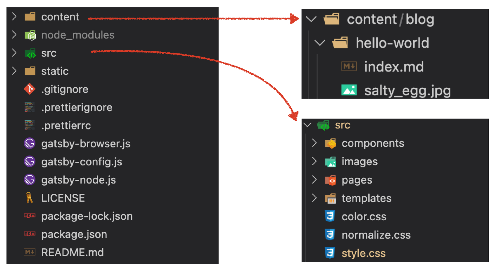
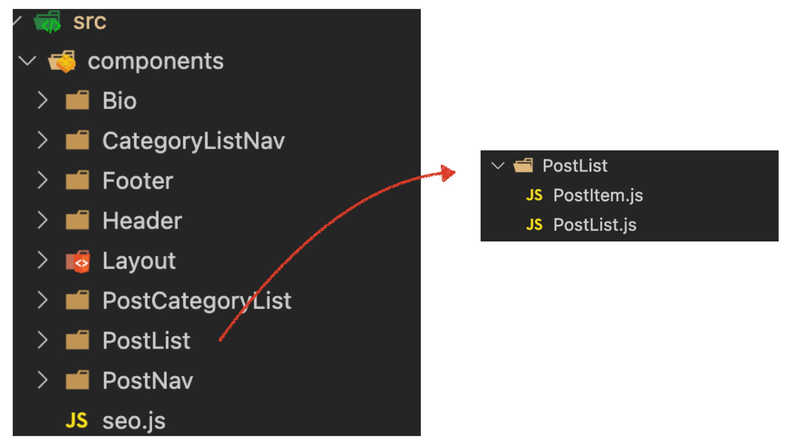
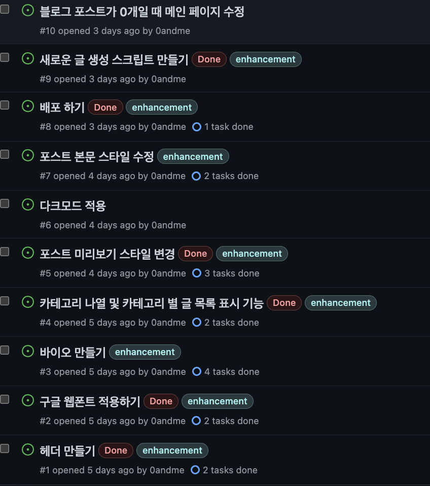

<!-- 타이틀1 -->

#### 🚩 TODO

- 초기 프로젝트 파일 구조 확인하기
- 프로젝트 구조 만들기

#### 📃 초기 프로젝트 파일 구조를 확인해보자

커스텀을 위해서 먼저 파일 구조를 확인하여 블로그가 어떻게 굴러가고 있는지 파악했다. 다운받아본 템플릿마다 폴더 구조는 조금씩 달랐지만 큰 구조는 비슷했다.

**✤ gatsby-starter-blog 템플릿의 초기 구조**

처음 프로젝트를 만들면 위와 같은 폴더 구조를 확인할 수 있다. 주요 폴더는 아래와 같다.

<!-- contents -->

◦ contents

블로그 포스트 관련 파일들을 저장하기 위한 폴더

하위 blog 폴더 아래 만들어진 폴더명이 블로그 주소로 사용되고 그 아래 index.md파일에 포스트 내용을 작성하면 된다.

 
<!--components  -->

◦ src/components

react component를 저장하는 폴더

 
<!-- images -->

◦ src/images

이미지 파일을 저장하는 폴더

 
<!-- pages -->

◦ src/pages

페이지의 역할을 하는 컴포넌트를 저장하는 폴더. 기본으로 <code class="language-text">404.js</code>와 <code class="language-text">index.js</code>와 타입스크립트 파일이 들어있다. 이 폴더에 저장된 파일 이름을 통해 브라우저에서 접근 할 수 있게 된다.

ex) pages폴더아래 <code class="language-text">about.js</code>를 만들면 <code class="language-text">주소/about</code>으로 접근 가능

 
<!-- templates -->

◦ src/templates

기본적으로 <code class='language-text'>blog-post.js</code>가 들어있고 포스트의 내용을 화면에 그리는 컴포넌트이다.

<!-- 타이틀2 -->

#### 🤔 새로운 컴포넌트 파일을 어떻게 저장할지에 대한 고민

<code class="language-text">contents</code> 폴더 나 <code class="language-text">gatsby-XXX.js</code> 파일을 제외하고 src폴더만 보면 react로 개발하는 방법과 매우 유사했기 때문에 커스텀을 시작하는게 그리 어렵지 않았다! 컴포넌트를 추가하기에 앞서 src 폴더 내에 새로운 컴포넌트나 컨테이너 파일을 어떻게 저장할지 대한 고민을 했다.

<a target='_blank' href="https://blog.banksalad.com/tech/build-a-website-with-gatsby/">뱅크 샐러드의 블로그</a>에서는 <code class="language-text">pages/containers/components</code> 로 구분하여 컴포넌트를 관리하는데 나는 컨텐츠가 복잡하지 않았고 추가할 컴포넌트도 그리 많지 않을 것 같았다.
 

그래서 <code class="language-text">pages</code>와 <code class="language-text">components</code>폴더는 그대로 사용하고 components 폴더 하위에 하나의 큰 컴포넌트 폴더를 만들어 관리하는 쪽을 택했다. 지금 블로그를 작성 중인 시점의 components 폴더는 아래처럼 구성되어 있다.

<!-- 타이틀3 -->

#### 👩🏻‍🎨 이제 본격적으로 블로그를 꾸며보자!

위의 사진처럼 깃헙 이슈에 만들고자 기능이나 수정할 부분에 대한 리스트업을 쭈욱 해두었다. 중간 중간 생각나는대로 추가해두고 개발하려고 한다.

커밋 메시지를 쓸때 해당 이슈번호를 넣으면 자동으로 이슈와 커밋메시지가 붙으니 나중에 기능별로 커밋을 묶어볼 수 있다는 장점도 있다.

다음에는 블로그내 추가한 기능들에 대한 글을 써보려한다.
