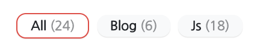
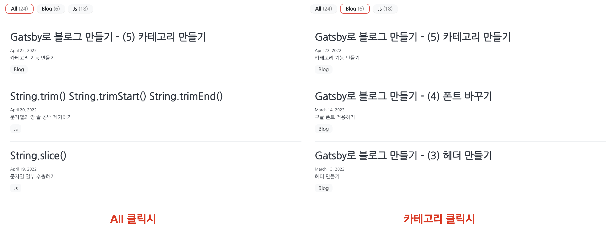

#### 💡 만들고자 하는 기능은?

만들고자 하는 기능은 다음과 같다.

메인 페이지에서 모든 카테고리를 출력하고 해당 카테고리를 누르면 각 카테고리별 포스트만 출력되는 형태이다.
<br>
또한, 각 포스트는 여러 개의 카테고리를 가질 수 있다.

<div class="tab light">(이 글을 적는 시점에는 하위 카테고리 기능도 추가했지만 이 글에서는 다루지 않는다)</div>

#### 🚩 TODO

- md 파일 내에 카테고리 속성 추가
- 카테고리 출력 컴포넌트 만들기
- graphql로 모든 카테고리 긁어오기
- 선택된 카테고리를 포함하는 포스트 필터 기능 만들기

#### 1️⃣ 카테고리 속성 추가하기

##### 1. md 파일에 카테고리 속성 작성하기

gastby 테마마다 다르겠지만 기본적으로 md 파일의 상단에 파일에 대한 정보를 담는 부분이 있을 것이다. 나는 여기에 카테고리 속성 `categories`을 추가하였다

나는 여러개의 카테고리를 담는 경우도 생길 것 같아 `[ ]` 배열 형태로 카테고리를 작성하자는 규칙을 세웠다.

```jsx
---
title:
date:
description:
categories: [Blog]
---
```

##### 2. GraphQL 스키마 정의하기

먼저 스키마와 타입을 작성해줘야 한다는 것을 알게 된 것은 에러를 만나면서였다. 카테고리를 렌더할때 카테고리가 있을 때와 없을 때를 분명 구분하였는데도 GraphQL 관련 에러가 났다. 그러다 문득 데이터를 긁어올 때 `categories` 를 가져오라고 시켰는데 그게 뭔지 안 알려줬구나 등록을 안해줬구나! 깨달았다.

해당 내용은 `gatsby-node.js` 파일에 명시하고 있었다. 해당 파일에서 `Frontmatter`의 타입을 지정해주는 부분에 아래 코드를 추가해주었다. `categories`는 string 배열임을 정의 하였다.

```jsx
createTypes(`
  ...
 type Frontmatter{
   ...
   categories: [String] // 추가한 코드
 }
 `)
```

#### 2️⃣ 카테고리 컴포넌트 만들기

카테고리 리스트인 `CategoryList` 컴포넌트를 만들고 카테고리 각각의 아이템 컴포넌트인 `CategoryItem` 컴포넌트를 만들었다. CategoryList에서 카테고리 배열을 가져온 다음 CategoryItem컴포넌트에 카테고리 하나의 정보를 내려줄 것이다.

#### 3️⃣ graphql로 모든 카테고리 긁어오기

CategoryList 컴포넌트에서 카테고리 배열을 가져와보자. `useStaticQuery` 을 이용하여 모든 카테고리를 긁어왔다.

여러 블로그를 참고하여 어떻게 가져오는지 살펴 본 후 gastby에서 제공하는 `http://localhost:8000/___graphql` 에서 미리 확인해본 후 코드를 추가하였다.

모든 카테고리명 `fieldValue`와 카테고리별 포스트 개수 `totalCount`, 총 포스트 개수 `totalCount`를 긁어오는 코드이다.

```jsx
const data = useStaticQuery(graphql`
  query {
    allMarkdownRemark(sort: { fields: [frontmatter___date], order: DESC }) {
      group(field: frontmatter___categories) {
        fieldValue // 카테고리 명
        totalCount // 카테고리 별 포스트 개수
      }
    }
    totalCount // 총 포스트 개수
  }
`)
```

`data.allMarkdownRemark.group`에 모든 카테고리 배열이 들어가 있고 출력해보면 아래와 같은 형태로 들어가 있음을 확인 할 수 있다. 이 데이터들을 이용하여 카테고리 컴포넌트를 만들면 된다.

```jsx
console.log(data.allMarkdownRemark.group)
// [
//   { fieldValue: "Blog", totalCount: 6 },
//   { fieldValue: "Js", totalCount: 18 },
// ]
```

#### 4️⃣ 카테고리 별 포스트 출력 기능 만들기

##### 1. 카테고리 선택 기능

CategoryItem 카테고리 아이템을 클릭할 때마다 해당 요소의 이름으로 카테고리를 변경하는 기능을 만들어보자. <br>CategoryList와 PostList 둘 다 선택된 카테고리명에 영향을 받으므로 두 컴포넌트의 상위에 있는 `index.js`에서 현재 카테고리를 담을 변수를 선언해주었다. 초기값은 `All`로 지정해두었다.

```jsx
//index.js
// 현재 카테고리를 저장할 변수
const [selectCate, setSelectCate] = React.useState("All")
return (
  <>
    {/* 카테고리 리스트 컴포넌트*/}
    <CategoryList
      selectCate={selectCate}
      setSelectCate={setSelectCate}
      ...
    />
    {/* 포스트 리스트 컴포넌트*/ }
    <PostList selectCate={selectCate} ... />
  </>
)
```

[📄 index.js 전체코드](https://github.com/0andme/0andme.github.io/blob/main/src/pages/index.js)

**PostList**에는 현재 카테고리에 따라 포스트를 필터 시켜야 하므로 현재 카테고리 변수 selectCate 만 내려주었다.

CategoryList의 하위 컴포넌트인 **CategoryItem**는 선택된 요소와 그렇지 않은 요소의 스타일 구분을 다르게 하기 위해서 현재 카테고리를 알아야 하고, 각 요소를 클릭할 때마다 카테고리를 변경해야한다. 따라서 상위 컴포넌트 CategoryList가 내려받은 selectCate, setSelectCate를 그대로 내려 받는다.

또한 나의 경우 카테고리 리스트 내에 `All`이라는 카테고리가 있는데 이는 graphql로 내려받은 카테고리명이 아니다. 따라서 `CategoryList`에서 아래와 같이 `item` props에 카테고리명과 포스트 개수를 직접 넣어주었다.

```jsx
//CategoryList.js
return (
  <ul css={CategoryListStyle}>
    {/*모든 카테고리 출력을 위한 All 카테고리 아이템 추가*/}
    <CategoryItem
      selectCate={selectCate}
      setSelectCate={setSelectCate}
      item={{
        fieldValue: "All",
        totalCount: data.allMarkdownRemark.totalCount,
      }}
    />
    {/*graphql로 가져온 카테고리 리스트 map을 통해 렌더*/}
    {cateList.map(cateItem => {
      const { fieldValue } = cateItem
      return (
        <CategoryItem
          selectCate={selectCate}
          setSelectCate={setSelectCate}
          key={fieldValue}
          item={cateItem}
        />
      )
    })}
  </ul>
)
```

전체 코드는 아래와 같다.

[📄 CategoryList 카테고리 리스트 컴포넌트 전체 코드](https://gist.github.com/0andme/e060900ad7f016e6daea1beca1078e0e)
<br>
[📄 CategoryItem 카테고리 아이템 컴포넌트 전체 코드](https://gist.github.com/0andme/16cb809363edb5ea5409a73bb290b0c3)

##### 2. 선택된 카테고리를 갖는 포스트 출력 기능

선택된 카테고리명을 **포스트 리스트 PostList**로 내려주었으니 이를 활용하여 포스트를 필터시키면 된다.

내가 작성한 로직은 다음과 같다.

1. 카테고리 `selectCate`가 `All`일 때는 모든 포스트를 담고 있는 배열 `posts`를 map 시킨다. <br>
2. All이 아닐 때는 posts를 필터한 배열 `filterPosts`에 대해 map 시킨다.

나의 경우, 하나의 포스트는 여러 개의 카테고리를 갖는 형태이기 때문에 find문을 넣었다.

```jsx
const filterPosts = posts.filter(post => {
  return post.frontmatter.categories.find(cate => cate === selectCate)
})
```

해당 로직의 전체 코드는 아래와 같다.

```jsx
// All이 선택된 경우
// 모든 포스트 출력
if ("All" === selectCate) {
  return (
    <ol>
      {posts.map(post => {
        return <PostItem key={post.fields.slug} post={post} />
      })}
    </ol>
  )
}
// All이 아닌 카테고리를 눌렀을 때
// 해당 카테고리를 갖는 포스트 출력
else {
  const filterPosts = posts.filter(post => {
    return post.frontmatter.categories.find(cate => cate === selectCate)
  })
  return (
    <ol c>
      {filterPosts.map(post => {
        return <PostItem key={post.fields.slug} post={post} />
      })}
    </ol>
  )
}
```

[📄 PostList 포스트 리스트 컴포넌트 전체 코드](https://gist.github.com/0andme/fe02e6aab622615b92bdac61aea570a0)

#### 🎉 최종 결과물

아래와 같이 선택된 카테고리를 갖는 포스트만 출력하는 기능을 완성하였다!


글을 추가적으로 작성하면서 Js 카테고리의 하위 카테고리로 객체나 문자열, 배열을 추가하면 글을 더 쉽게 모아 볼수 있겠다는 생각이 들었다. 다음에는 하위 카테고리를 추가한 방법에 대해 작성해보겠다.
